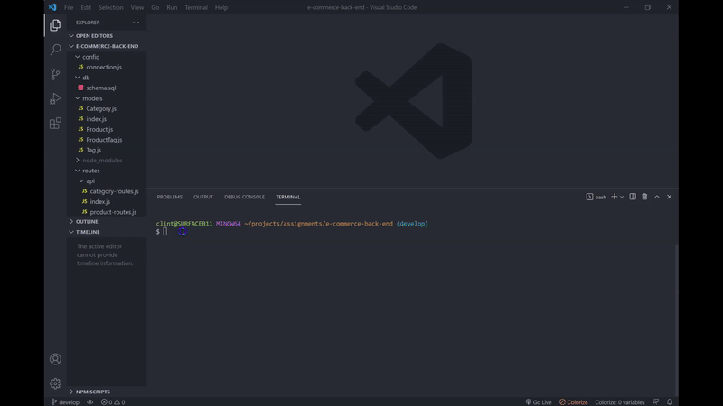

# E-commerce Back End
       

## 📜 Description
A back end for an e-commerce site using Express.js and Sequelize.

## 📋 Table Of Contents

- [Installation](#%EF%B8%8F-installation)
- [Usage](#%EF%B8%8F-usage)
- [Walkthrough Video](#%EF%B8%8F-walkthrough-video)
- [Final Output GIF](#%EF%B8%8F-final-output-gif)
- [License](#-license)
- [Contributing](#-contributing)
- [Questions](#-questions)
  

## ⚙️ Installation

Please clone the repo, install mysql on your device and run the following command

```
npm install
```


## 🖥️ Usage

You need to create and seed the database first, then start the server. Mockup content is already created. Please create the database in MYSQL and run the following commands

1. Create the databse in mysql
```
source db/schema.sql
```
2. Seed content using the following command
```
npm run seeds
```
3. Start the server
```
npm start
```

## 🎞️ Walkthrough Video

[**Click Here**](https://youtu.be/6Gxf1hMDpi8) to view the walkthrough video.

## ▶️ Final Output GIF




## 📝 License

This application is covered under the [MIT](https://choosealicense.com/licenses/mit/) license.


## 🤝 Contributing

Contributions, issues and feature requests are welcome. Feel free to check issues page if you want to contribute.


## ❓ Questions

If you have any questions regarding this application, please reach out via email or github!

📧 Email : pravton_dev@outlook.com

🤖 GitHub : https://github.com/pravton
